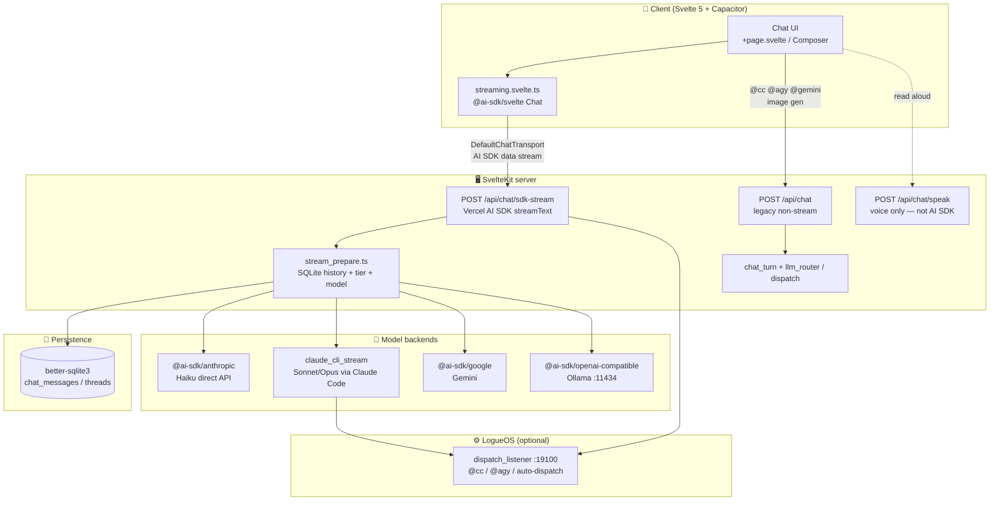
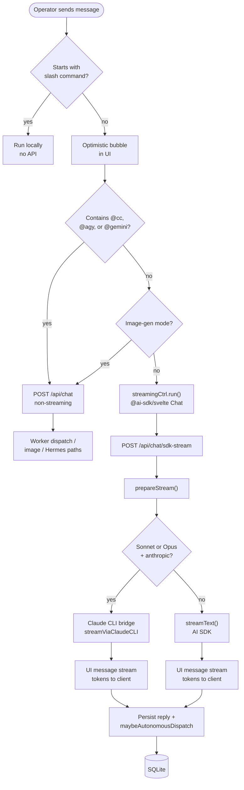
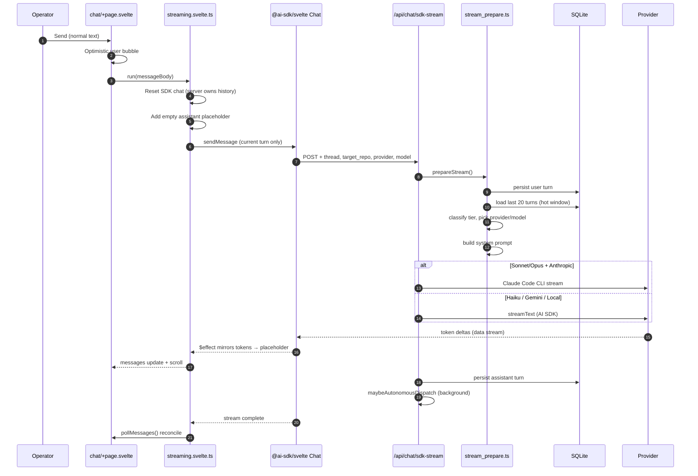
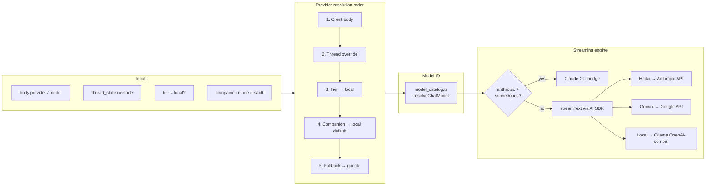
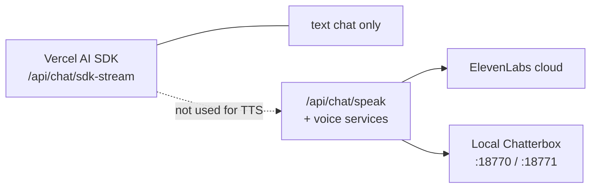

# Sully (LogueOS-Companion) — Chat Stack & Architecture Review

**Prepared by:** Cursor (interactive session)  
**Date:** 2026-06-02  
**Scope:** Which SDKs the companion uses, how messages flow end-to-end, visual diagrams, and whether the approach is sound.  
**Audience:** Operator self-review (not a ship gate).

---

## Executive summary

Sully is **not** built on the **Cursor SDK**. It is built on **SvelteKit + Svelte 5 + Capacitor** for the app shell, and **Vercel AI SDK v6** (`ai` + `@ai-sdk/*`) for streamed multi-provider chat.

That is a **sound** architecture for an operator companion with model picker, tools, local Ollama, SQLite history, optional LogueOS worker dispatch, and voice on separate HTTP paths. Complexity comes from **intentional branching** (stream vs dispatch, CLI vs direct API, voice off to the side), not from choosing the wrong platform.

---

## 1. Which SDK for an AI chat app? (general)

Two different “SDK” meanings apply:

| Goal | Effective SDK | Why |
|------|----------------|-----|
| **Operator chat app** (streaming replies, tools, threads, multi-model) | **[Vercel AI SDK](https://sdk.vercel.ai/)** — `ai` + `@ai-sdk/anthropic`, `@ai-sdk/google`, `@ai-sdk/openai-compatible`, `@ai-sdk/svelte` | One API for `streamText`, tool calling, UI message protocol, and swapping providers. Fits SvelteKit/Next-style backends. |
| **Agent that edits a repo** (CI bot, “fix this PR”, headless worker) | **[Cursor SDK](https://cursor.com/docs/sdk)** — `@cursor/sdk` (TS) or `cursor-sdk` (Python) | `Agent.create` + `agent.send` + `run.stream()` — runs Cursor agents on code, not a chat-product layer. |
| **Thin wrapper on one vendor only** | Provider SDKs (Anthropic, OpenAI, Google GenAI) | Fine for minimal prototypes; you rebuild streaming, tools, and client protocol yourself. |

**Recommendation for greenfield chat products:** Vercel AI SDK + one `@ai-sdk/*` package per model family + framework adapter (`@ai-sdk/svelte` or React equivalent).

**When to use Cursor SDK instead:** Automation — trigger an agent from a script, GitHub Action, or backend job. **Not** for the Sully/Console message UI.

---

## 2. What Sully uses today (inventory)

### 2.1 App shell

| Piece | Package / tech |
|--------|----------------|
| UI framework | **Svelte 5** (runes) |
| Web app | **SvelteKit 2** + **Vite 8** |
| Styling | **Tailwind CSS 4** |
| Native iPhone app | **Capacitor 8** (`@capacitor/ios`, etc.) |
| Server adapter | `@sveltejs/adapter-node` |

**Source:** `LogueOS-Companion/package.json`

### 2.2 Chat SDK (primary)

| Package | Role |
|---------|------|
| `ai` ^6.0.191 | Core: `streamText`, UI message stream, tools |
| `@ai-sdk/svelte` ^4.0.191 | Client `Chat` + transport |
| `@ai-sdk/anthropic` | Claude models |
| `@ai-sdk/google` | Gemini |
| `@ai-sdk/openai-compatible` | **Ollama** at `http://127.0.0.1:11434/v1` |

**Not used for Sully chat:** Cursor SDK (`@cursor/sdk` / `cursor-sdk`).

### 2.3 Client path (default send)

| File | Responsibility |
|------|----------------|
| `src/lib/chat/streaming.svelte.ts` | `Chat` from `@ai-sdk/svelte` + `DefaultChatTransport` |
| `src/routes/chat/+page.svelte` | Send routing, optimistic UI, slash commands |
| **HTTP target** | `POST /api/chat/sdk-stream` |

The client **resets SDK chat history before each send**. The server is the single source of truth for conversation context (see `prepareStream` hot window).

### 2.4 Server path (streamed chat)

| File | Responsibility |
|------|----------------|
| `src/routes/api/chat/sdk-stream/+server.ts` | `streamText` or CLI bridge; returns UI message stream |
| `src/lib/server/chat/stream_prepare.ts` | Shared preamble: persist, classify tier, hot window, provider/model, system prompt |
| `src/lib/chat/model-registry.ts` | Canonical picker + server provider name mapping |
| `src/lib/server/model_catalog.ts` | `resolveChatModel` — tier × provider matrix |
| `src/lib/server/chat/autonomous_dispatch.ts` | Post-reply background dispatch (companion mode) |
| `src/lib/server/claude_cli_stream.ts` | Sonnet/Opus via Claude Code CLI (Max OAuth) |

### 2.5 Model providers

| Provider | Wiring | Auth / endpoint notes |
|----------|--------|------------------------|
| **Anthropic (Haiku)** | `@ai-sdk/anthropic` + `streamText` | `CLAUDE_CODE_OAUTH_TOKEN` preferred; else `LOGUEOS_ROUTING_KEY` / `ANTHROPIC_API_KEY` |
| **Anthropic (Sonnet/Opus)** | `streamViaClaudeCLI` | CLI bridge — Max OAuth does not grant direct API for Sonnet/Opus |
| **Google (Gemini)** | `@ai-sdk/google` | `GEMINI_API_KEY` / `GOOGLE_API_KEY` |
| **Local (Ollama)** | `@ai-sdk/openai-compatible` | `OLLAMA_BASE_URL` default `http://127.0.0.1:11434/v1`; includes `companion-v2` when pinned in registry |

### 2.6 Non-SDK-stream paths (by design)

| Trigger | Endpoint | Behavior |
|---------|----------|----------|
| Message contains `@cc`, `@agy`, or `@gemini` | `POST /api/chat` | Non-streaming; worker dispatch |
| Image-gen mode | `POST /api/chat` | Non-streaming |
| Slash commands | Client-local | No API |

**Routing logic:** `src/routes/chat/+page.svelte` — `useStream = !isDispatch && !isGenImage`.

### 2.7 Persistence & LogueOS integration

| Piece | Tech |
|-------|------|
| Chat history | **better-sqlite3** — `chat_messages`, thread meta/state |
| Autonomous workers | **dispatch_listener** (default `http://127.0.0.1:19100`, HMAC) |
| App identity | `LOGUEOS_APP_MODE=companion` in `.env` (gitignored) — must set so dispatch targets companion workspace, not Console |

### 2.8 Voice (separate from chat SDK)

| Piece | Notes |
|-------|--------|
| `POST /api/chat/speak` | ElevenLabs cloud + local TTS |
| Local services | Chatterbox / related on **18770 / 18771** (on-demand) |
| **Intentionally not** `streamText` | Lighter protocol for read-aloud / voice-turn; documented in companion peer synthesis |

### 2.9 Security boundary (chat)

- **No app-level cookie auth** on chat routes (iOS PWA + Tailscale Funnel cookie issues — see `hooks.server.ts` comments).
- **Tailscale Funnel + undisclosed hostname** = boundary for public access.
- **Sensitive tools** (`baseTools` + file/web): only when **not** via Funnel **or** valid `x-companion-tools-key` (`/unlock`).

---

## 3. Visual diagrams

### 3.1 Big picture — what stack does what

### 3.2 Operator taps Send — routing decision

### 3.3 SDK stream path (sequence)

### 3.4 Inside `prepareStream` — provider & engine selection

**Provider resolution (from `stream_prepare.ts`):**

1. Explicit `body.provider` (client model picker)
2. `thread_state.provider_override`
3. Tier `local` → local provider
4. Companion mode default → `local` (unless `COMPANION_LOCAL_DISABLED`)
5. Fallback → `google`

**CLI vs direct:** `useClaudeCLI = provider === 'anthropic' && /sonnet|opus/i.test(resolvedModelId)`.

### 3.5 Voice (separate from chat SDK)

---

## 4. Cheat sheet

| Path | Endpoint | SDK / stack |
|------|----------|-------------|
| **Normal chat** | `/api/chat/sdk-stream` | Vercel AI SDK 6 |
| **@cc / @agy / @gemini / images** | `/api/chat` | Custom / dispatch (not streamed AI SDK) |
| **Read aloud / voice** | `/api/chat/speak` + local voice services | ElevenLabs + Chatterbox (not AI SDK) |
| **Cursor SDK** | — | **Not used** in Sully |

**One-line mental model:**

> Sully = SvelteKit PWA/native shell + Vercel AI SDK for streamed multi-provider chat + SQLite history + optional LogueOS worker dispatch + separate voice HTTP services.

---

## 5. Architecture soundness assessment

### 5.1 Verdict

**Yes — this is a sound architecture** for:

- Self-hosted, multi-provider, tool-using chat
- SQLite-backed threads
- iPhone delivery (Capacitor + PWA constraints)
- Hooks into LogueOS workers and local Ollama

The main risk is **complexity and drift** across branches, not wrong technology. **Do not** rip out Vercel AI SDK for Cursor SDK or raw provider SDKs unless the product definition changes.

### 5.2 What is genuinely sound

1. **Vercel AI SDK as the chat layer** — standard choice for streaming + tools + provider swap.
2. **Server owns conversation memory** — hot window from SQLite; client SDK is transport-only.
3. **Shared `prepareStream`** before CLI vs `streamText` split — prevents preamble drift.
4. **Clear send-time routing** — stream vs dispatch vs image at the UI layer.
5. **Voice off the chat stream** — correct for latency, cost, and failure isolation.
6. **Security model matches iOS/Tailscale reality** — no broken cookie gate; server-side keys.
7. **Unified model registry** — `model-registry.ts` + `model_catalog.ts` reduce picker/server drift.

### 5.3 Real costs (own them, not fatal)

| Area | Why it's costly | Wrong? |
|------|-----------------|--------|
| Two chat backends (`sdk-stream` + `/api/chat`) | Two test matrices | No — different jobs |
| Two streaming engines (CLI + `streamText`) | More failure modes | Acceptable for Max/CLI Sonnet/Opus |
| Client SDK reset each send | Unusual vs tutorials | Fine with server-canonical history |
| Companion + autodispatch + LogueOS | Routing blast radius | Sound if `LOGUEOS_APP_MODE=companion` enforced |
| Phased migration comments in code | Mental load | Normal; consider a single “current truth” page |

### 5.4 What would be less sound (mostly avoided)

- Cursor SDK inside the chat loop
- Browser-held API keys
- One giant `/api/chat` doing everything without separation
- Trusting `body.messages` from the client for model context

### 5.5 When to reconsider the foundation

Only if product goals shift materially:

| New goal | Implication |
|----------|-------------|
| Thin client to **one** vendor API | Could drop multi-path routing |
| Every reply is a **full repo-editing agent** | Less streamed chat, more dispatch/CLI |
| **Sub-100ms voice-turn** chat | Redesign around realtime session protocol, not request/response `streamText` |

For **operator companion + model picker + Ollama + optional dispatch**, current shape stays appropriate.

### 5.6 Practical soundness checklist

- [ ] Default send always hits `sdk-stream` and persists both sides to SQLite
- [ ] Thread switch / second turn still includes prior context (hot window = 20)
- [ ] Sonnet/Opus use CLI path without surprise billing
- [ ] Local works when Ollama is up and registry pin is correct (`companion-v2`, etc.)
- [ ] `@cc` dispatch never accidentally goes through `streamText`
- [ ] Voice failures do not break chat
- [ ] `LOGUEOS_APP_MODE=companion` set on every install (`.env` gitignored)

---

## 6. Key source files (quick index)

| Concern | Path |
|---------|------|
| Dependencies | `package.json` |
| Client transport | `src/lib/chat/streaming.svelte.ts` |
| Send routing | `src/routes/chat/+page.svelte` |
| Stream API | `src/routes/api/chat/sdk-stream/+server.ts` |
| Shared preamble | `src/lib/server/chat/stream_prepare.ts` |
| Model picker catalog | `src/lib/chat/model-registry.ts` |
| Server model resolution | `src/lib/server/model_catalog.ts` |
| CLI bridge | `src/lib/server/claude_cli_stream.ts` |
| Legacy / dispatch API | `src/routes/api/chat/+server.ts` |
| Voice TTS | `src/routes/api/chat/speak/+server.ts` |
| App / dispatch config | `src/lib/server/config.ts` |

---

## 7. Related peer reviews & canon

| Doc | Relevance |
|-----|-----------|
| `data/peer_reviews/2026-05-30-cc-synthesis.md` | Voice path separation from SDK stream |
| `data/peer_reviews/companion_peer_review.md` | UX audit (separate from this stack doc) |
| `LogueOS-Orchestrator/.logueos/context/current_lane.md` | Active lane: Sully QLoRA + companion-v2 |
| Vercel AI SDK docs | https://sdk.vercel.ai/ |
| Cursor SDK docs | https://cursor.com/docs/sdk (automation only, not Sully chat) |

---

## 8. Open questions (for future you)

1. **Consolidate `/api/chat`?** — Could dispatch/image move behind tools or a single orchestrator route, at the cost of a large refactor.
2. **Retire `llm_router.ts` on stream path?** — Confirm nothing critical still bypasses `sdk-stream`.
3. **Kill legacy custom-SSE `/api/chat/stream`?** — Comments reference PR 2b cutover; verify route is gone or unused.
4. **Document “current truth”** — One page listing only active endpoints (stream vs legacy vs voice).

---

*End of review. Regenerate or extend this doc when the sdk-stream cutover completes or provider matrix changes materially.*
